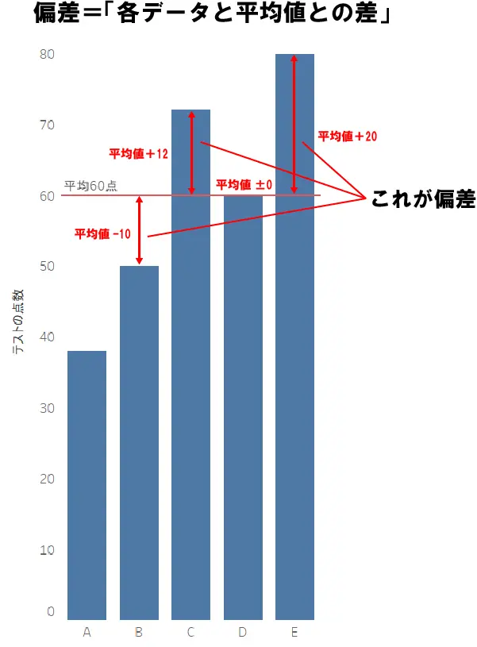

# Pythonのメモ
## printメソッド
### 標準出力でデータを表示
```py
print("こんにちは") #型関係なく出力できる
print(43)
print(3.14)
print(True)
```

## 複数の値を出力
### print()はコンマ区切りで複数の値を出力できる
```py
name = "秀伍"
age = 19
print("名前：", name, "年齢：", age)
```

## フォーマット指定
### Python3.6以降はf""で変数を簡単に埋め込める
```py
print(f"名前：{name}, 年齢：{age}")
```

### format()を使う
### format()でフォーマットを指定することが可能
```py
print("名前：{},年齢：{}".format(name,age))
```

## 改行や区切り文字
### endを使ったら改行せずに、空白や任意の文字で出力を繋げれる
```py
print("こんにちは", end=" ")
print("秀伍さん")
```
```
結果：こんにちは 秀伍さん
```

### sepで指定した文字区切りをする
#### ここで日付フォーマットやCSV形式への変換に使われる
```py
print("2025","06","03", sep="-")
```
```
結果：2025-06-03
```

## sys.stdoutで標準出力の変更
### もし標準出力を制御したい場合は、sysモジュールのsys.stdoutを使う
#### ログ出力のカスタマイズ時に便利です。
```py
import sys
sys.stdout.write("これも出力できます\n)
```

## 配列の定義
### 通常の配列の定義方法
```py
fruits = ["apple","banana","cherry"]
```
### タプル（変更不可のリスト）の定義方法
```py
floats = (35.68, 139.86)
```

### 辞書：シンボラー型配列（キーと値のペア）
```py
user = {"name": "秀伍", "age": 19}
```

### 集合（ユニークな要素のみ）
#### ユニークな要素とは...値が重複せず、重複した値は自動的に排除される
```py
unique_numbers = {1,2,3,3,3,4}

#要素の追加
unique_numbers.add(5)

#要素の削除
unique_numbers.remove(3)
```
```
出力：{1,2,4,5}
```

## 配列に要素の追加
### 可変長の順序月データ構造 - リスト
```py
fruits = ["apple","banana","cherry"]
#配列の要素を出力
print(fruits[0])
#配列の末尾に値を追加
fruits.append("grape")
```

## 辞書の基本操作
```py
user = {"name": "秀伍", "age": 19, "location": "Shimane"}

#検索
print(user["age"])

#値の変更
user["name"] = "藤原秀伍"

#キーの追加
user["job"] = "engineer"

#キーの削除
del user["location"]
```

### 集合の演算
#### 集合を使えば集合演算を作ることができる
```py
a = {1,2,3}
b = {3,4,5}

print(a | b)
print(a & b)
print(a - b)
```

## 条件分岐
### ifで（）なしの、条件分岐
#### インデント構文なので間違えるとエラーになる
```py
x = 10

if x > 5
  print("xは5より大きい")
elif x == 5
  print("xは5")
else:
  print("xは5より小さい")
```

## ループ
### forとwhileが使える
```py
# for文
for fruit in fruits:
  print(fruit)

# while文
count = 0
while count < 5:
  print(count)
  count += 1
```

### for文で繰り返し1 ~ 10をする方法
```py
for i in range(9): # rangeでインクリメントされていく
  print(i+1)
```

## メソッドの作り方
### 返り値のreturnをつける
```py
def greet(name):
  return f"こんにちは{name}さん"

greet("花子")
```
### rubyのようなreturnなしはできない
```py
def greet(name):
  name

greet("花子")
```
```
結果：None
```

## クラスの作り方
### コンストラクタは__init__を使う
### インスタンスメソッドはselfを引数とし、self.メンバ変数でインスタンス変数にアクセスできる。
```py
class Person:
  def __init__(self,name): # パイソンのメソッドは第一引数に自分が所属するインスタンス名を書かないといけない
    self.name = name

  #インスタンスメソッドはself（自分自身）を引数としないといけない。
  def display(self):
    print(f"名前は{self.name}")
```

## クラスの継承
### 継承する際は、親クラスを引数としてクラスを定義する。コンストラクタでは、super()親クラスを参照できる
```py
class Animal(LivingThings):
  def __init__(self,name,age,birthday):
    super().__init__(name,birthday)
    self.age = age

  def display_data(self):
    super().display_data()
    print(f"年齢：{self.age}")
```

## クラスメソッド、スタティックメソッドの追加
### @マークを使って、区別する
```py
@classmethod #クラスメソッドはクラス変数を呼び出せて、クラス外部内部両方から呼べる
メソッド名:

@staticmethod #スタティックメソッドはクラス変数を扱えず、単独でしか機能しない
メソッド名：
```

## カプセル化について
### カプセル化をするものの直前に__をつける
```py
class Person:
  __age = 19 #カプセル化をする変数は__を事前に着ける

  def __init__(self,name,age):
    self.name = name
    self.__age = age

  def getAge(self):
    return self.__age
```
```py
# 上でカプセル化した変数にアクセスしてみる
human = Person("田中",18)

print(human.__age)
```
```結果```
```
Error
```

# データの分析ついて
## 標準偏差のおさらい
### 偏差とは

    偏差とは各データと平均値との差のことを言う



### 標準偏差とは

    標準偏差は偏差の考え方に似ている。「標準的な偏差」=「標準的な平均値との差」ということになる。
    つまり各データの偏差を統計し、平均的にこのくらいの偏差がありますよ～ということ

### 分散

    標準偏差をさらに二乗して線形な性質を持たせたもの

    ※ただし、データの値を重視する場合、標準偏差。
    データの分析をする場合、分散。

## データ分析に移る前に学習しておくべき内容
- ### モジュールとライブラリのインポート
- ### 平均、中央値、標準偏差、分散
- ### 確率分布（正規分布、ポアソン分布）
- ### 相関係数と回帰分析の基本
- ### CSVやExcelファイルの読み込み、書き出し
- ### Pandasを使ったデータフレーム操作（フィルタリング、グループ化）
- ### NumPyを使った数値計算（行列計算、統計処理
- ### MatplotlibやSeabornを使ったグラフ作成
- ### ヒストグラム、散布図、折れ線グラフの描画
- ### Jupyter Notebookの使い方
- ### Google Colaboratoryの活用
- ### 仮想環境（Anacondaやvenv）のセットアップ