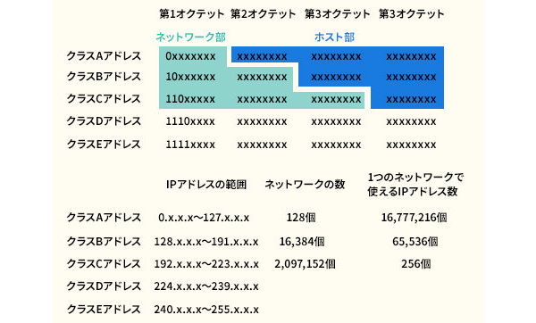
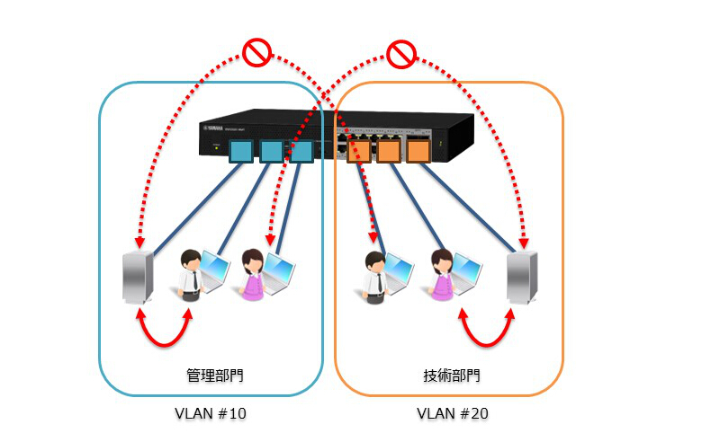
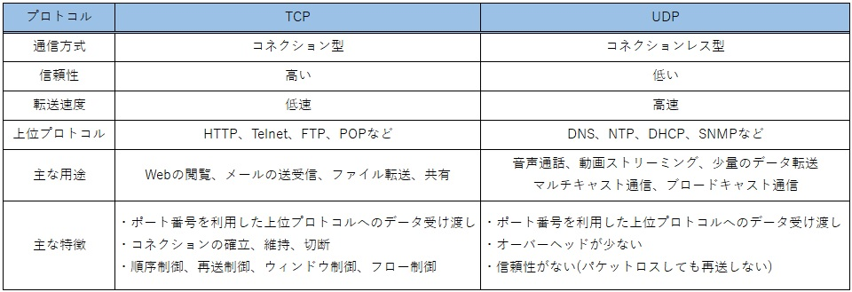

# サーバー構築のメモ

- [LANについて](#lanとは-local-area-network)
- [WANについて](#wanとは-wide-area-network)
- [LANとWANを接続](#離れたlanとlanを接続)
- [インターネットとは]()## インターネットとは
## イントラネット
## 通信プロトコル
## TCP/IPとは
## ネットワークアーキテクチャ
## 重要なネットワークアーキテクチャ
## TCP/IPの4階層モデル
## 通信の仕組み
## データ（パケット）を分割する理由
## データの形式
## レイヤー


## LANとは Local Area Network
### 外部とは直接接続されていないネットワーク

    会社内のネットワークや家庭内のネットワークなど
    比較的狭い範囲でのコンピュータネットワーク

## WANとは Wide Area Network

### 本社-支社、支社-支社など
### 離れたLANとLANを相互に接続するためのもの

    NTTやKDDIなど電気通信事業者が開設している。
    どこと接続するかがわかっており
    接続先がどこかが不明なインターネットとは違う。


## 離れたLANとLANを接続
### 通信事業者による広範囲なネットワーク

    ルータから中の世界はLAN
    ルータから外の世界がWAN

## インターネットとは
### 世界中のネットワークと相互接続できるもの

    プロバイダー、企業、大学、公的機関などが
    相互に接続してネットワークを形成している。

    インターネットへの接続先を提供するサービス事業者である
    「ISP(Internet Servise Provider)」が相互接続したネットワーク
    広い意味でのWANの一種とも言える

## イントラネット
### 一般的に社内独自のネットワークとしてインターネットの仕組みを会社内等に構築したもの

    企業内に閉じられたネットワークであり、
    情報共有や業務支援に活用する目的として
    構築されるシステム

## 通信プロトコル
### 通信機器同士でデータのやり取りを行うために「お互いにやり取りしているデータが何なのか」を理解しあい、「どこにどうやって送るのか」などについて決まりごとが必要

例
- 通信データの形式
- 通信データの表現方法
- どの危機にデータを送るのか
- 通信成功時の動作、通信エラーの動作

### 通信を行う上でのこうした決まり事を、通信プロトコル（または単にプロトコル）という

## TCP/IPとは

    TCPが正しいIPアドレスに送る通信プロトコル
    逆にUDPは速さを重視した通信プロトコル

## ネットワークアーキテクチャ
### プロトコルとして用意するべき通信機能の役割分担を定めたものを、ネットワークアーキテクチャと呼びます。

    ネットワークアーキテクチャは通信に必要な機能がいくつかの階層に分けられています。
    実際の通信では各階層に相当するプロトコルが利用されて、通信の機能を実現します。

## 重要なネットワークアーキテクチャ

- ### OSI参照モデル

    通信機器や端末同士をつなぐための考え方を示したモデル
    物理層からトランスポート層までを通信機能という
    セッション層からアプリケーション層までをアプリケーション機能という


- ### TCP/IP

    インターネット上で通信を行うための
    決まり事を定めたモデル

## TCP/IPの4階層モデル

- アプリケーション層（HTTP,POP,SNMP,DHCP,DNS）
- トランスポート層（TCP,UDP）
- インターネット層（IPv4,ICMP）
- ネットワークインターフェース層（イーサネット）

※上記の層のことをレイヤーという

## 通信の仕組み

分割されたデータを**セグメント**という
ア、プ、セでデータを作成する
<div style="background-color: yellow color">
トで送信ポート、宛先ポートなど　-> セグメント、データグラム
ネで送信IPアドレス、宛先IPアドレス -> パケット
デで送信MACアドレス、宛先MACアドレス -> フレーム

## データ（パケット）を分割する理由

大きなデータを一時的に通信すると、ほかのデバイスがネットワークに接続できなくなってしまうから

## データの形式
アプリケーション層、プレゼン層、セッション層
hello.htmlなどの「Hello」出力
トランスポート層
1＊＊＊＊や2＊＊＊＊などのように何番目かのデータか先頭に記しておく
ネットワーク層,データリンク層
B1＊＊＊＊やB2＊＊＊＊はB1宛てですよ～B2宛てですよ～という感じ
物理層
00＊＊＊＊＊などは00から始まるから私宛てですよ～みたいな感じ

## レイヤー
<hr>レイヤー１<hr>
レイヤー１はLANケーブルなど。規格は2.5GBASE-Tなどがあるが、このTはモールのように折れる線のことをいう
規格にも２種類ある
1. ストレートケーブル
2. クロスケーブル

### ストレートケーブル
    PCとハブなどを接続するときに使用
### クロスケーブル
    PC同士、HUB同士、PCを直接ルータに接続するときなどに使用、現在、自動的にクロスとストレートは判別されることが多いのであまり使用されていない
    なぜクロス？
    送信：受信
    受信：送信
    と、二つの送受パターンがあり、クロスして見えるからクロスケーブル
    ハブを通してデータを送受するよりも直接クロスケーブルで通信したほうが10倍ぐらい早いから今でも使われる

<hr>レイヤー２<hr>
レイヤー２は各ネットワークアーキテクチャでは以下に当たる

- OSI参照モデル ：  データリンク層
- TCP/IP        ：  ネットワークインターフェース層

レイヤー２の通信には主にMACアドレスが利用される
## WI-FI
### 規格として「g」と「a」がある

### ***a(5GHz)の方が早い***

```メリット```

    通信速度が速い

```デメリット```

    対応していない機械がよくある
    障害物に弱いので電波が弱くなってしまう
    屋外で電波を飛ばすと電波法違反になる

### ***g(2.4Hz)は遠くまで届く***

```メリット```

    障害物に強く、電波が遠くまで飛ぶので、壁をまたいで使用したり、無線ルーターから遠く離れた場所で使用したりする場合に適している

```デメリット```

    電子レンジや、Bluetoothなどの製品でも使用される電波だから干渉してしまう

## MACアドレス
### 様々なNIC(Network Interface Card:ネットワーク機器)にそれぞれ割り振られている番号
### ※世界中で重なることはない

    8bit6桁であらわされ、各桁のことをオクテッドという
    各オクテッドの区切りは「-」や「：」で表記され上位３位オクテッドはベンダーコード(OUI)、下３オクテッドはベンダーが重複しないように管理している

```Bash
例： 74 - 27 - EA - B5 - E5 - 0B
   |ベンダーコード|
```

### MACアドレスを取得するコマンド
基本的な情報を出力
```Bash
getmac
```
接続名がわかる
```Bash
getmac /v 
```


## レイヤー２の通信機器
### レイヤー２の主な通信機器としてL2スイッチがある

### L2スイッチについて

    ネットワークを流れるデータのデータリンク層の情報を
    判断材料として通信先を振り分ける。
    複数の通信を同時に処理できる

    L2スイッチは、接続された機器のMACアドレスを通信時に記憶する。
    送信先のMACアドレスが登録されていれば送信相手にのみ
    信号を流し、登録されていなければ全部のポートに信号を流す。

    また機種によってVLANに対応している

### ブロードキャスト
ルーター内の通信可能なすべてのアドレス
つまり、同一ネットワーク内のすべてのアドレスを参照することになる

### MACアドレステーブルを使う

レイヤー２スイッチの中で接続先となるMACアドレスをMACアドレステーブルに書いておく


## レイヤー３の通信
レイヤー３は各ネットワークアーキテクチャでは以下にあたる

    OSI参照モデル：ネットワーク層
    TCP/IP：インターネット層

レイヤー３の通信には、主にIPアドレスが利用される。

## IPアドレス（IPv4）
### 32bitで表される論理アドレス
### 8bitずつ.(ドット)で区切り10進数で表す。
### 「どのネットワーク」の「どのコンピュータ」の情報が入っている。

    例：192.168.0.1 (１０進数)
    ↓
    11000000.10101000.00000000.00000001 (2進数)

## ネットマスクとは
### IPアドレスからネットワークの部分を抽出するためのマスク値

```ネットマスクの使い方```

    IPアドレスが192.168.0.1、ネットマスクが255.255.255.0の場合
    それぞれを2進数で表すと以下
    IPアドレス      11000000.10101000.00000000.00000001
    ネットマスク    11111111.11111111.11111111.00000000

    並べたときにネットマスクが1の部分のIPアドレスがネットワークを表す部分になり、
    ネットワーク部と呼ばれ、0の部分のIPアドレスがコンピュータを表す部分になり、ホスト部と呼ばれる。

    IPアドレス      11000000.10101000.00000000.00000001
    ネットマスク    11111111.11111111.11111111.00000000
                 +---------------------------+--------+
                                ネットワーク部　ホスト部
    IPアドレスを使った通信ではネットワーク部が同一なコンピュータ同士でしか通信できない

上記のIPアドレスの場合

    ネットワークアドレス（ネットワークそのものを表すアドレス）
    11000000.10101000.00000000.00000000 -> 192.168.0.0
    ブロードキャストアドレス（ルータ下のIPアドレスを全て参照するアドレス）
    11000000.10101000.00000000.11111111 -> 192.168.0.255

## 特殊なアドレス
### ループバックアドレス

    自分自身に帰ってくるアドレス。
    IPアドレスの先頭が127ではじまり、主に127.0.0.1が使われる。

        アドレスが以下の状態（IPアドレス：192.168.0.1、ネットマスク：255.255.255.0）

        IPアドレス      11000000.10101000.00000000.00000001
        ネットマスク    11111111,11111111,11111111,00000000
                      +--------------------------+--------+
                                    ネットワーク部 ホスト部
        
        上記IPアドレスのPCで127.0.0.1を指定すると
        192.168.0.1を指定した状態（自分自身のIPアドレスを指定した状態）と同じとなる

    つまり、127.0.0.1と192.168.0.1は同じ参照先（自分）を表す
## 豆知識
- 通信速度であるbpsのpはパーというが、これは「/」スラッシュを表している。なのでb/sとも読み取れる
- オクテッドは8bitでオクトパス(タコ)だからオクテッド
- MACアドレスを販売する人をベンダーという

## IPアドレスのクラス
- ### クラスA
        先頭の8bitがネットマスクになり、先頭のオクテットは０から始まり１０進数の範囲は１から１２６
- ### クラスB
        先頭の１６bitがネットマスクになり、先頭のオクテットは１０から始まり１０進数の範囲は１２８から１９１になる。接続するPCの台数が６５５３４台以下の通信で使用される。
- ### クラスC
        先頭の２４bitがネットマスクになり、先頭のオクテットは１１０から始まり１０進数の範囲は１９２から２２３になる。接続するPCの台数が２５４台以下の通信で使用される。



## サブネットマスクとは
### ネットマスクは８bitずつで指定するが、ブロードキャストが必要な通信をする場合に、無駄なアドレスに問い合わせを行うとことになる。

### 上記を避けるためにホスト部の一部をネットマスクとして使用すること。最近ではネットマスクと同じ意味でつかわれることが多い。

        11000000 10101000 00000000 00000001
        |--------ネットマスク------|--|
                                    ^サブネットマスク
        11111111 11111111 11111111 11000000

## IPアドレスとサブネットマスクの表記法
### IPアドレスの後ろにネットマスクまたはネットマスクのbit数を表記

        ネットマスク：192.168.0.1 / 255.255.255.0

        ネットマスクのbit数：192.168.0.1 / 24

## IPアドレス関連のコマンド
- ### IPアドレスの確認
    ```bash
    ipconfig[オプション]
    ```

        オプション
        /all  設定されているすべての情報を表示
        /renew IPアドレスを取得し直す

### 通信できるかの確認
- ### icmpという特殊なプロトコルを使い、指定された送信先に到達できるかチェックする

    ```bash
    ping 送信先
    ```
## ipconfig
- IPアドレスは論理アドレス
- MACアドレスは物理アドレス
- DHCPは自動でIPアドレスを割り当てる(LANケーブルを外すと機能しない)
- リースの取得はIPアドレスを借りた日付


- ### ipconfig /allは情報をすべて出す
- ### ipconfig /renewはIPアドレスを更新し、取得する

## グローバルアドレスとプライベートアドレス
### グローバルアドレスとは
世界中で重複しないように振られているIPアドレス
### プライベートアドレスとは
LAN内の組織内で使われているIPアドレス

### プライベートアドレスからグローバルアドレスに通信するにはアドレス変換（NAT）を使う

## アドレス変換（NAT）- Network Adress Transration
### ルーターは「ローカルのアドレス」と「グローバルのアドレス」の２つのIPアドレスを持っている。

    元来のNATは、送受信するパケットの送信元・宛先IPアドレスだけを識別して変換するものであったため、複数の機器が同時に外部ネットワークに接続する場合は、その機器数と同数のグローバルIPアドレスが必要であった。

    そこで現在は、プライベートIPアドレスとグローバルIPアドレスの１対１の変換に加え、ポート番号も変換してグローバルIPアドレスとプライベートIPアドレスを、１対多に変換するNAPTが用いられることが多い。

## 分かりやすくした説明したもの
    ルーターはグローバルIPアドレスを１つしか持たないので、NATはローカルIPアドレス１つを相対的に変換できていた。しかし、ポート番号というものが生まれたので、一つのIPアドレスで複数のポート番号及びローカルIPアドレスに接続できる

    IPアドレスとポート番号はどこから借りているのか？ー＞プロバイダー
    グローバルIPアドレスは、長い間使っていなかったら自動で返している

## ルーターのアドレス変換を使った通信

    NAPTでは、IPアドレスに加えてポート番号の識別や変換をすることで、複数のホストからローカル外のネットワークに接続する際、異なるローカルのアドレスを同一のグローバルアドレス配下の異なるポートとして表現し、必要なグローバルアドレスの数を減らすことができる。

    動的NAPTは、インターネットプロバイダーから利用者に対するグローバルIPアドレスの割り当て等で、よく用いられる。

## NATとNAPT
- ### NAT 

## IPv6
### 16bitごとに区切り、８つのグループに分けたIPアドレス。(128bit)
### 16bitごとに「:(コロン)」で区切った上で、16進数で表記する・

        IPv4は2の32乗 = 約43億個のIpアドレスとなるが、
        世界的なインターネット人口の増加により、IPアドレスが足りなくなった。

        IPv6は128ビットでの表現となり、
            2の128乗 = 43億 * 43億 * 43億 * 43億
        となり、事実上無限にIPアドレスを割り当てることができる

        (例)　aa11:22bb:bb33:44cc:abcd:1234:aaaa:1111

### 現在はIot(物のインターネット)により、インターネットとつながれているデバイスにもグローバルIPアドレスが降られてしまうため、IPアドレスが枯渇した

## IPv6 その２
### IPv6はアドレスが無限に使えるため、各通信端末に直接IPv6のグローバルアドレスが振られるほか、IPoE方式でインターネットを使用すると高速化が図れる。

#### ※IPv6の接続方式は、PPPoE(PPP over Ethernet)とIPoE(IP over Ethernet)の２種類

### ただし、サーバーがIPv6に対応していないと通信できないほか、IPv4とは通信することができない。

#### ※「IPv4 over IPv6」を利用することでIPv6環境下でIPv4アドレスによる接続が可能
IPv4 over IPv6はIPv4もv6も操作できるプロトコルなのでどちらも対応可能
## プロバイダー
### PPPoEはプロバイダー経由でインターネットにつなげること (PPPは電話回線のプロトコル)
インターネットとプロバイダーの間は早いが、プロバイダーとユーザのルータの間は会社による

### IPoEはプロバイダーなしでインターネットにつなげること
機械そのものとインターネットを直接つなぐので早くなる。

### NATが行われる回数（通るルータの数）
        １ユーザのルータ
        ２プロバイダ
        ３プロバイダーのルータ
        ４インターネット
        ５プロバイダーのルータ
        ６プロバイダ
        ７サーバーのルータ
        ８サーバー
### tracertでいくつ通っったか分かる


## IPv6の表記方法
### 128ビットを16ビットずつ8つに":"(コロン)で区切った数値列を、16進数で表記。ただし、以下の３つのルールで表記を省略することができる。

- ### 1.フィールドごとに先頭の0の並びは省略可能
        例　01DA -> 1DA , 0012 -> 12 , 01B0 -> 1B0 , 00fe -> fe
- ### 2.フィールドのビットが全て0の場合、一つの0に省略可能
            例　0000 -> 0
- ### 3.ビットがすべて0のフィールドが二つ以上連続している場合、その間の0を全て省略して二重コロン(::)に省略可能。
        例　2001:0000:0000:0000:aaaa:bbbb:cccc:1111 -> 2001::aaaa:bbbb:cccc:1111

### ※ただし「::」は一つのIPv6アドレス内で一度だけしか使用できない
        例（×）2001:0000:0000:1111:aaaa:0000:0000:1111 -> 2001::1111:aaaa::1111
        例（〇）2001:0000:0000:1111:aaaa:0000:0000:1111 -> 2001::1111:aaaa:0:0:1111

        例２
            0abc:00ab:000a:0000:0000:0001:0012:0123 -> abc:ab:a::1:12:123

### ビットがすべて0のフィールドが二つ以上連続している場所が二か所以上ある場合
### １）最長の場所を省略する
### ２）同じ長さだったら左側を省略

## 省略表記の問題
        abc0:00ab:0000:0000:00c0:0000:0000:a0b0
        ->abc0:ab::c0:0:0:a0b0

        abc::abc:0:0
        ->0abc:0000:0000:0000:0000:0abc:0000:0000

## レイヤ3の通信機器
### レイヤー3の主な通信機器としてルーター、L3スイッチがある。

### ルータとは
#### 主にNATやルーティングを行う。ネットワークを超えた通信を行うために使用される。主にインターネットなど外部（WAN）とのネットワーク通信で使用される

### ルーティングとは
#### データを送信・転送する際に、ルーティングテーブルの情報をもとに最適な転送経路を割り出すこと。特にインターネットなどのIPネットワークにおいて、パケットの転送先を決定すること


## レイヤー３の通信機器２
### L3スイッチとは
#### ルーティングを行うほかにVLANの制御を行う。ほぼルーターと同じ機能だが、内部のネットワークで使用される。

### ルーターとL3スイッチの違い
#### 特徴としてレイヤ３スイッチはTCP/IPでイーサネットのみの対応だがハードウェアで処理をするので高速。ルーターはwifiでの接続や違うプロトコルの接続もでき、NATが使えるがソフトウェアで処理をするので低速。またL3スイッチはVLANに対応しているがルーターは対応していない。

    ※レイヤー３はネットワーク層であり、そこで使われるからＬ３スイッチ
    ※Ｌ３スイッチはハードウェアなので、ルータより高速

### WiFiについて

        WiFiルータとはルータの機能をすると同時に、HUBからつながれてくるLANケーブルも処理するプロトコルを機能してるので、WiFi + ルータで「WiFiルータ」と呼ばれる

## VLANとは
### ポート番号などでLANを論理的に分割する技術
#### LANケーブルを接続するハブのことを言う。



### VLANのメリットとしては
- ### ブロードキャストドメインの分割が可能

        MACアドレスのブロードキャストも遮断できるため、PCやネットワークの負荷が減らせる。
- ### 物理的な配置に関係なくセグメント化できる

        一階と三階のように環境が分かれていても、同じVLANで分けられる。

- ### セキュリティの向上

        分割されたネットワーク同士は接続されていないため、データが転送されることはない。

### ポート番号で分けるVLANのほかに、タグVLAN、MACベースVLAN、ユーザーベースVLAN等がある。

## トランクリンクについて
### VLANを使用している2つのスイッチをつなぐもの
異なるVLANでも一つのトランクリンクで接続できる（スイッチ間接続専用リンク）

        どのVLAN所属のデータであるかを識別するために配属先VALNを識別するためのタグという情報を
        トランクリンクを通す際に
            タグを付加　または
        トランクリンクを抜ける際に
            タグを除去
        している


## レイヤー４の通信
### レイヤー４の各ネットワークアーキテクチャでは以下にあたる
- ### OSI参照モデル：トランスポート層
- ### TCP/IP      ：トランスポート層

### レイヤー４の通信としては、TCP、UDP、IPなどがある。

## TCPとは
### TCP(Transmission Control Protocol)
### パケットの並び替えや、不達パケットの再送信などを行うプロトコル。メールやホームページなど、信頼が必要な通信の時に使用される。
### ※TCPはコネクション型通信（通信開始前に相手との間で仮想的な通信路を確保する）
- ### 1.通信相手の相互通信路の確保
- ### 2.データの送信
- ### 3.データの受信応答


        補足
        ・上記の画像は今から通信しますよ～という意味になる
        ・不達パケットとは、相手に届かなかったパケットのこと
## UDPとは
### UDP(User Datagram Protocol)
### パケットの並び替えや、不達パケットの再送信などを行わないプロトコル。正式な接続の確立をしないことで、通信を高速化。
### IP電話やオンライン動画など、リアルタイム性が必要な通信の時に使用
#### ※UDPはコネクションレス型通信（通信開始前に相手との間で、事前のやり取りなし）


## TCPとUDPの比較
### 通常はUDPだと変なデータが入るかもしれないから使わないのが基本


## IPの通信
### IP(インターネット・プロトコル)

    IPはネットワーク層/インターネット層のプロトコルです。
    TCPとUDPの両方をサポートしている。

### IPの通信を

    TCPで行うことをTCP/IPという。
    また「UDP/IP」もTCP/IPに含めることがある。


## レイヤー４～７の通信機器
### 主な通信機器としてロードバランサがある

### ロードバランサとは

    負荷分散装置とも呼ばれ、複数台のサーバーがある時、処理を分散する仕組みを提供する装置

